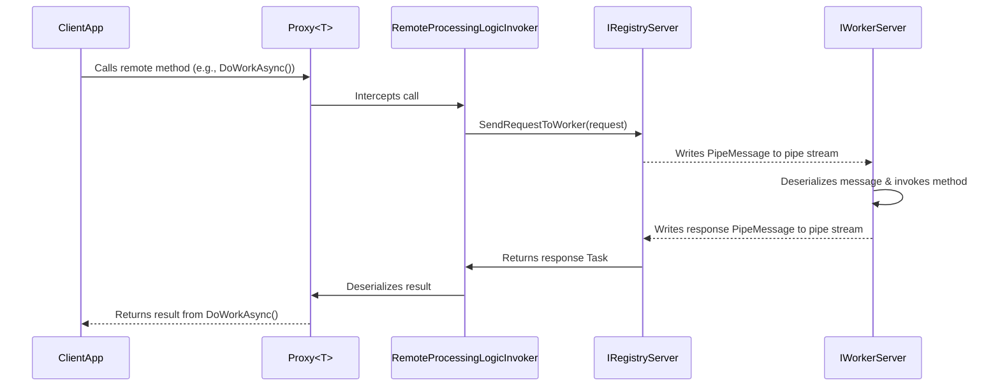

# NamedPipesProxy for .NET

[](https://github.com/DKorablin/NamedPipesProxy/releases/latest)
[](https://www.nuget.org/packages/AlphaOmega.NamedPipesProxy)

## Overview

`NamedPipesProxy` is a lightweight and powerful .NET library that simplifies inter-process communication (IPC) using named pipes. It enables you to create a dialogue between different processes by generating dynamic proxy classes for your interfaces. This allows you to make remote procedure calls (RPC) as if you were invoking a local method, abstracting away the underlying communication complexity.

The library is designed for scenarios where a central server needs to manage and communicate with multiple worker processes. It handles connection management, message serialization, and method invocation routing, making it easy to build robust distributed systems.

## Key Features

- **RPC via Dynamic Proxies**: Call methods on remote objects as if they were local.
- **Server-Worker Architecture**: A central server manages connections from multiple worker clients.
- **Asynchronous Communication**: Built with `async/await` for non-blocking operations.
- **Cross-Framework Compatibility**: Supports both .NET Framework and .NET Standard.
- **Message Serialization**: Uses `Newtonsoft.Json` for flexible and robust data transfer.

## Supported Frameworks

The library is multi-targeted to support both legacy and modern .NET applications:

-   .NET Framework 4.8 (`net48`)
-   .NET Standard 2.1 (`netstandard2.1`)

## Architecture

The library consists of several key components that work together to enable remote communication:

-   **`RegistryServer`**: The core server component. This component is responsible for listening for worker connections, managing connected workers, and dispatching messages.
-   **`WorkerServer`**: The client-side component that connects to the `RegistryServer`, registers itself, and listens for incoming requests to execute.
-   **`RemoteProcessingLogicBuilder`**: A static factory class used to create the dynamic proxy instances. It uses `System.Runtime.Remoting` on .NET Framework and `System.Reflection.DispatchProxy` on .NET Standard/.NET Core.
-   **`RemoteProcessingLogicInvoker`**: The proxy implementation that intercepts method calls made on the proxy object. It serializes the method call information into a `PipeMessage` and sends it to the server for processing by a worker.
-   **`PipeProtocol`**: A helper class that handles the low-level details of reading from and writing to the named pipe stream. It ensures that messages are framed correctly with a length prefix.
-   **`PipeMessage`**: The Data Transfer Object (DTO) that encapsulates a method call or its response, which is then serialized and sent over the pipe.

## Logic Diagram

The following diagram illustrates the sequence of events during a remote procedure call from a client application to a worker process.



## How to Use

### 1. Define a Contract Interface

Create an interface with the methods you want to expose for remote invocation.

```csharp
public interface IMyProcessingLogic
{
	Task<string> ProcessDataAsync(string data);
}
```

### 2. Implement the Server

Create a server that implements `IRegistryServer` and listens for worker connections.

```csharp
// In your server application
var server = new RegistryServer("registry-pipe-name");
await server.StartAsync(cancellationToken);

// Create a proxy to send commands to all connected workers
var logicProxy = server.CreateProcessingLogic<IMyProcessingLogic>();

// This call will be broadcast to all connected workers
await logicProxy.ProcessDataAsync("Hello, workers!");

// Create a proxy to send commands to a specific worker by its ID
var workerLogicProxy = server.CreateProcessingLogic<IMyProcessingLogic>("worker-01");

// This call will be sent only to the worker with ID "worker-01"
await workerLogicProxy.ProcessDataAsync("Hello, worker 01!");
```

### 3. Implement the Worker

Create a worker that connects to the server and provides the implementation for the contract interface.

```csharp
// In your worker application
public class MyLogic : IMyProcessingLogic
{
	public Task<string> ProcessDataAsync(string data)
	{
		string result = $"Processed: {data.ToUpper()}";
		Console.WriteLine(result);
		return Task.FromResult(result);
	}
}

var implementedLogic = new MyLogic();
var worker = new WorkerServer<IMyProcessingLogic>(
	"registry-pipe-name", // The same pipe name as the server
	"worker-", // Worker ID prefix
	"01", // Unique worker ID
	implementedLogic // The instance that implements the interface
);
await worker.StartAsync(cancellationToken);
```

When `logicProxy.ProcessDataAsync(...)` is called in the server application, the `NamedPipesProxy` library routes the call to the `ProcessDataAsync` method on the `MyLogic` instance in the worker application.